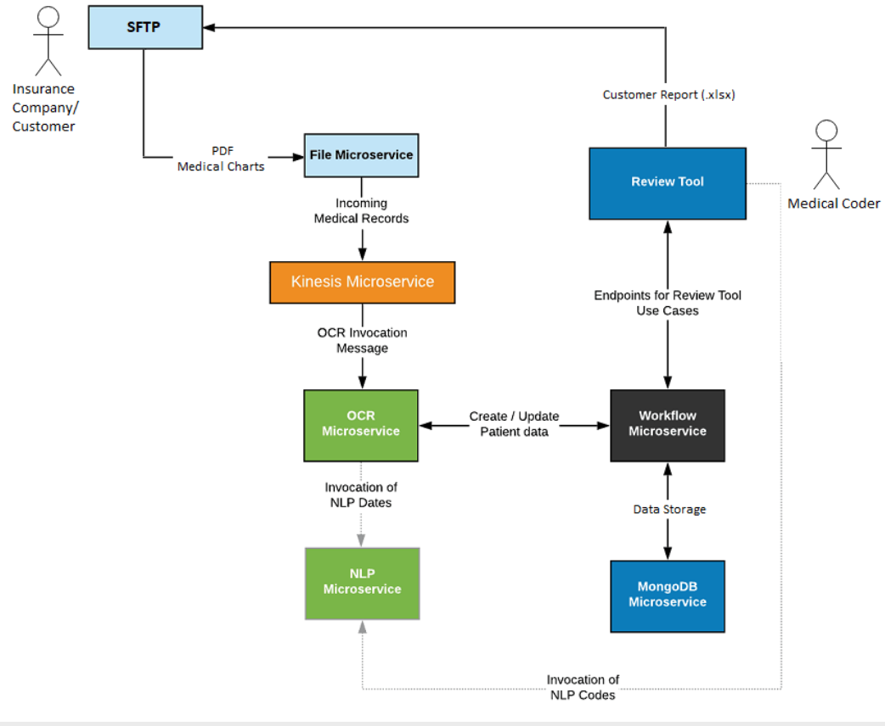
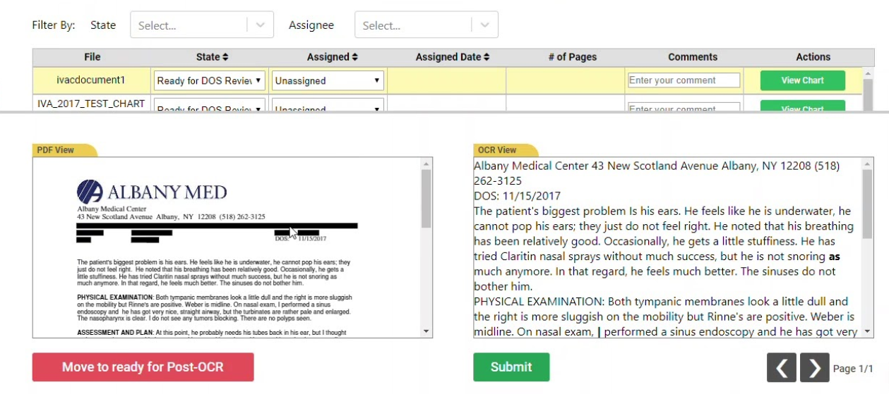
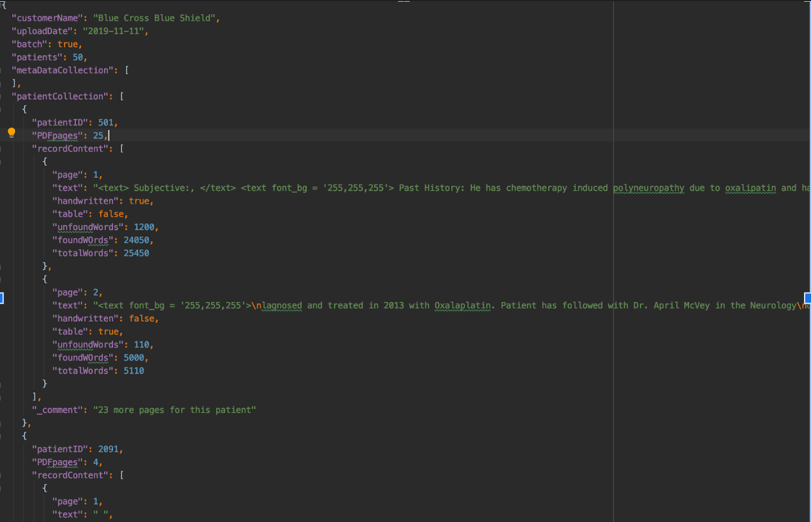

# OCR System Project Process and POCs
A “hybrid” service model, in which client-sent records are processed and coded via automated IP of OCR / NLP / Coding Rules and, for those records that are deemed too hard for the system to process.

## High-Level Bussiness Diagram
<p align="center">
    
</p>

## System Front-end Sneak-peak
<p align="center">
    
</p>

## Tehnology Stack of overall Solution
### AWS tech stack:
```
- S3 (defined by customer)
- ECS (for OCR and NLP)
- RDS (Database)
- CloudFormation
- SQS
```

### OCR:
```
- Tesseract
- OpenCV2
- Spacy
- PDF Miner
- ImageMagick, GhostScript
```

### Frontend & Backend: 
(A few AWS services mentioned above will also be used for hosting and data management)
```
- ReactJS
- Python (Django development framework)
- AWS CLI : Boto3 (Backend & OCR)
- Jenkins (CI/CD)
- Modules : Tesseract, Textract, OpenCV 2, Spacy
```

## Example of OCR JSON output
<p align="center">
    
</p>
